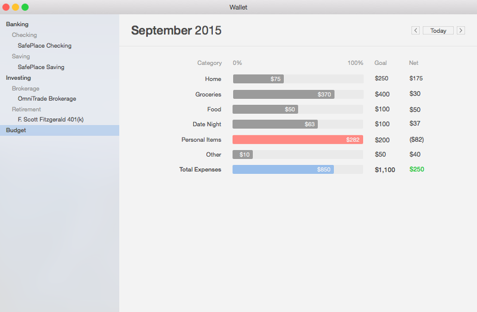

# Wallet
Wallet is a solution to keeping track of your finances.

The images below are mockups done in Sketch.

It is currently still in development but plans to have the following four core features:

1. Monitor Bank Transactions
2. Create a budget
3. Monitor investments
4. Helpful tools
  - Compound interest calculator
  - Retirement calculator
